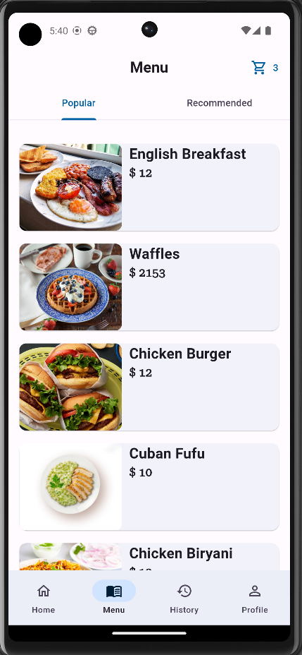

# Food Ordering App

This is a Food Ordering App built using the [Getx](https://github.com/jonataslaw/getx) library for efficient state management. Getx provides a simple and powerful solution for managing reactive state, navigation, and dependencies in Flutter applications.

For the backend, the app utilizes the popular [Laravel](https://laravel.com/) framework. Laravel is a robust PHP framework that offers a wide range of features for building scalable and secure web applications. With Laravel, the app benefits from a solid foundation for handling complex backend functionalities, such as user authentication, API integrations, and database management.

## Screenshots

### Home Page

### Food Details Page

### Menu Page

### Cart History Page

### Account Page

### Cart Page

### Address Page

### Map Address Selection Page

### Sign In Page

## Getting Started

This project is a starting point for a Flutter application.

A few resources to get you started if this is your first Flutter project:

- [Lab: Write your first Flutter app](https://docs.flutter.dev/get-started/codelab)
- [Cookbook: Useful Flutter samples](https://docs.flutter.dev/cookbook)

For help getting started with Flutter development, view the
[online documentation](https://docs.flutter.dev/), which offers tutorials,
samples, guidance on mobile development, and a full API reference.
